# Meal Identification MI-D-A — Mobile UI Flow Discovery & Contract Plan

Status: **FROZEN** (planning-only; no UI implementation in this round)

## 1. Baseline Authority

- Branch: `main`
- Baseline HEAD (start of MI-D-A): `b6843d8376d6757e5bf91986f35d4ce42ddb9d1f`
- Parent: `320499280fcad30a8608443760e6b274ce1133fe`
- MI-C-D canonical RPC: `finalize_current_user_meal_identification_v1`
- Development migration history: 44/44 (tracked), protected migration untouched
- Protected migration: `supabase/migrations/20260722010000_cache_restaurant_current_access_context_plan.sql` (path/SHA-256 only — `4e08de96d28a5e6d9911b074fa73769ea5b3e21d9e14a089c7f420e16a4fbe72` — never opened)

This document is planning-only. It does not modify Mobile UI, routes, components, hooks, stores, services, migrations, or database contracts. All frozen MI-C-A/B/C/D semantics are treated as immutable inputs.

## 2. Current UI Entry Points

| Route | File | Role |
|---|---|---|
| `/meal-photo` | `apps/mobile/app/meal-photo.tsx` | Photo capture/upload entry point, precedes analysis |
| `/analysis` | `apps/mobile/app/analysis.tsx` | **The single screen** where AI meal analysis is reviewed, corrected, confirmed, and saved |
| `/today-intake` | `apps/mobile/app/today-intake.tsx` | Canonical Today Intake screen; navigated to after a successful save |
| `/meal-log` | `apps/mobile/app/meal-log.tsx` | Nutrition record / meal log detail screen |

`AnalysisScreen` (`apps/mobile/app/analysis.tsx`) is the **sole** integration point for this round. It is reached via `router.push("/meal-photo")` → analysis flow, and receives `params.mealSlot` (meal period) via Expo Router search params.

## 3. Current User Flow

1. User captures/uploads a photo (`/meal-photo`), lands on `/analysis`.
2. `AnalysisScreen` renders either:
   - `ExternalDiningAnalysis` (restaurant mode, not yet confirmed) — shows a top Catalog candidate (if any), Catalog resolution state, and primary/secondary CTAs.
   - `CandidateCorrectionList` (when `matchState === "editing"`) — full candidate list, "以上皆非" fallback, manual text correction panel.
   - `SelfCookedIntro` / `SelfCookedCorrectionPanel` (self-cooked mode).
   - `CompletedAnalysisHero` (when `matchState === "confirmed"`) — shows the confirmed result, next-meal carousel, "加入今日飲食" / "查看營養紀錄" buttons.
3. User confirms a Catalog candidate, corrects the identification, or switches to self-cooked/manual.
4. User taps the save action (`zhTW.mobile.refinedLogic.analysisFlow.saveMealRecord`, wired to `saveMealRecordFromExplicitGesture`).
5. On success, `mealSaved` becomes `true`; the screen switches to an in-place `TodayIntakeSummary` card **and** `router.push("/today-intake")` navigates to the real Today Intake screen.

## 4. Current Call Graph (with evidence)

```
apps/mobile/app/analysis.tsx : AnalysisScreen
  useAnalysisCorrectionState()          // apps/mobile/features/analysis/useAnalysisCorrectionState.ts
    ← getAnalysisSession()              // apps/mobile/features/analysis/analysisSessionStore.ts (module singleton)
  useConsumerRuntime()                  // apps/mobile/features/consumer-runtime (React context)
  useRestaurantCatalog()                // apps/mobile/features/restaurants/catalog
  resolveCatalogMealCandidates(...)     // apps/mobile/features/meal-identification (frozen MI-B)
  toTrustedCanonicalIdentity(...)       // apps/mobile/features/meal-identification (frozen MI-B/MI-C-A)

saveMealRecordFromExplicitGesture()
  → consumerRuntime.createMealRecord({  // ⚠ CURRENT (pre-MI-D-B) call — OLD path
      selectedMealPeriod, mealName, originalDetectedName /* hardcoded from zhTW mock data */,
      portion, nutrition, isSelfCooked, wasUserCorrected,
      trustedCanonicalIdentity: toTrustedCanonicalIdentity(analysis.selectedCandidate)
    })
      → ConsumerMealWriteRuntime.submit(...)         // apps/mobile/features/consumer-runtime/consumerMealWriteRuntime.ts
          → ConsumerMealRecordWriteService            // apps/mobile/features/consumer-meals/consumerMealRecordWriteService.ts
              → SupabaseConsumerMealRecordWriteRepository → create_current_user_meal_record[_v2] RPC (V1/V2, non-atomic w.r.t. analysis/corrections)
  → completeSuccessfulMealWrite(result)
      → if mode==="mock": persistCanonicalMealToExplicitDemoStore(...)   // apps/mobile/features/analysis/analysisMealRecordStore.ts (DEMO_ONLY, AsyncStorage)
      → setMealSaved(true)
      → router.push("/today-intake")

apps/mobile/app/today-intake.tsx
  useTodayIntakeUiModel({ revision: runtime.mealDataRevision, ... })   // ALREADY sums mealWriteState.mealDataRevision + mealIdentificationFinalizationState.finalizationDataRevision (wired by MI-C-D)
```

**Finding**: the current "save" button calls `consumerRuntime.createMealRecord(...)` — the **old** V1/V2 write path — not MI-C-D's `finalize_current_user_meal_identification_v1`. This is exactly the switch MI-D-B must make. `originalDetectedName` is currently read from a **hardcoded i18n mock value** (`zhTW.mobile.analysis.candidates[0].meal`), not from any real tracked AI-analysis state — see Section 10 for the resulting analysis-mapping gap.

## 5. Existing Write-path Classification

| Path | Classification | Reason |
|---|---|---|
| `consumerRuntime.createMealRecord(...)` call site in `analysis.tsx` | **REPLACE** | Confirmed via repo-wide search: `analysis.tsx` is the **only** UI caller of `createMealRecord`/`retryPendingMealRecord`/`mealWriteState`. Must be swapped for `finalizeMealIdentification`/`retryPendingMealIdentificationFinalization`/`mealIdentificationFinalizationState` so the write goes through the frozen atomic MI-C-D RPC instead of the non-atomic V1/V2 path that never durably persisted analysis or corrections. |
| `ConsumerMealWriteRuntime` / `ConsumerMealWriteOperationStore` classes | **PRESERVE** | Not deleted. `create_current_user_meal_record` (V1) is still called **internally**, at the database layer, by `finalize_current_user_meal_identification_v1` itself (confirmed in the frozen migration SQL). No other UI dependents to break. Deletion is unnecessary for MI-D-B and out of scope. |
| `SupabaseConsumerMealRecordWriteRepository` / `ConsumerMealRecordWriteService` / mock/disabled adapters | **PRESERVE** | Same reasoning; still exported from `consumer-meals/factories.ts` and wired into composition. |
| Planned meal write (`createPlannedMeal`, `updatePlannedMeal`, `cancelPlannedMeal`, `convertPlannedMeal`) | **NOT APPLICABLE** | Unrelated feature domain (user-scheduled future meals), no overlap with AI-analyzed meal identification. |
| Analysis persistence (durable `meal_analyses`) | **REPLACE** (supersedes a prior no-op) | No durable analysis persistence exists today via the old path — `create_current_user_meal_record` has no analysis-tracking columns. MI-C-D is what **introduces** this; the UI must start sending a real `originalAnalysis` snapshot. |
| Correction write (durable `meal_corrections`) | **REPLACE** (supersedes a prior no-op) | Same reasoning — today's `correctedRows`/`correctionCompleted` state is never durably persisted. |
| Today Intake update (`useTodayIntakeUiModel` + `runtime.mealDataRevision`) | **PRESERVE** | Already correctly wired: `ConsumerRuntimeProvider`'s `mealDataRevision` sums `mealWriteState.mealDataRevision + mealIdentificationFinalizationState.finalizationDataRevision` (MI-C-D change). Zero additional MI-D-B work needed for refresh to work once the call site switches. |
| Optimistic update | **NOT APPLICABLE** | No optimistic-update pattern exists in the current UI (save is a blocking await with an explicit `submitting` loading card); nothing to reuse or replace. |
| Retry/idempotency **pattern** (state machine, UUID v4, single in-flight guard) | **REUSE** | MI-C-D's `ConsumerMealIdentificationFinalizationRuntime` already faithfully mirrors `ConsumerMealWriteRuntime`'s pattern by design (same status enum, same `secureUuidV4()`, same retry-reuses-pending semantics). |
| Retry **call site** in `analysis.tsx` | **REPLACE** | Must call `consumerRuntime.retryPendingMealIdentificationFinalization()` instead of `retryPendingMealRecord()`. |
| `analysisMealRecordStore.ts` (local mock-mode demo store) | **PRESERVE** | Explicitly marked `DEMO_ONLY MOCK_DATA`; orthogonal to the real Supabase write path; still needed for `consumerRuntime.mode === "mock"` display in `analysis.tsx`'s own `TodayIntakeSummary`. |
| `analysisSessionStore.ts` / `useAnalysisCorrectionState.ts` (session + UI state) | **REUSE** | Continues to hold `selectedCandidate`, `matchState`, `correctedRows`, etc. MI-D-B needs a **new adapter** (not a replacement) that projects this state into `MealIdentificationFinalizationCommand` shape. |
| `meal-identification/finalizationContract.ts` (`buildMealIdentificationFinalization`) | **REUSE** | Frozen MI-C-A builder — this is exactly the function the new MI-D-B adapter must call to construct and validate the command before handing it to the runtime. |

## 6. MI-C-D Runtime Integration Boundary

Legal UI-facing entry points (all already committed and frozen at `b6843d8376d6757e5bf91986f35d4ce42ddb9d1f`):

```
useConsumerRuntime()  // apps/mobile/features/consumer-runtime/ConsumerRuntimeProvider.tsx
  .finalizeMealIdentification(draft: ConsumerMealIdentificationFinalizationDraft)
      : Promise<ConsumerMealIdentificationFinalizationRuntimeState>
  .retryPendingMealIdentificationFinalization()
      : Promise<ConsumerMealIdentificationFinalizationRuntimeState>
  .mealIdentificationFinalizationState: ConsumerMealIdentificationFinalizationRuntimeState
```

Where `ConsumerMealIdentificationFinalizationDraft = { mealType, finalization: MealIdentificationFinalizationCommand }` (`apps/mobile/features/consumer-runtime/consumerMealIdentificationFinalizationRuntime.ts`), and `MealIdentificationFinalizationCommand` is produced **only** via `meal.buildMealIdentificationFinalization(...)` / `meal.validateMealIdentificationFinalizationCommand(...)` from `apps/mobile/features/meal-identification` (frozen MI-C-A).

This is the **only** legal path. Explicitly confirmed prohibited and not present anywhere in the frozen MI-C-D code, and MI-D-B must not introduce any of the following:
- Direct Supabase client calls from UI
- Direct RPC calls from UI
- Direct table writes from UI
- A second/duplicate request mapper in the UI layer
- A second finalization contract
- Sending `user_id` (actor is derived server-side from `auth.uid()` only)
- UI-generated or UI-managed database stable IDs (all IDs come back from the RPC response only)
- UI "repair" of incomplete Catalog identity

## 7. UI State Machine

Per instruction, this reuses **existing** canonical names rather than inventing a parallel enum:
- `analysis.matchState`: `"pending" | "editing" | "confirmed"` (`apps/mobile/features/analysis/types.ts`, unchanged)
- `consumerRuntime.mealIdentificationFinalizationState.status`: `"idle" | "restoring" | "submitting" | "uncertain" | "succeeded" | "error"` (MI-C-D, frozen)
- `consumerRuntime.mealIdentificationFinalizationState.errorCode`: the MI-C-D typed error code union (frozen)

```mermaid
stateDiagram-v2
    [*] --> idle
    idle --> analysis_ready: candidate resolution loads / self-cooked estimate ready
    analysis_ready --> reviewing: user selects candidate (matchState=pending) or opens correction (matchState=editing)
    reviewing --> reviewing: edit name / add correction / switch mode
    reviewing --> analysis_ready: matchState becomes confirmed (ready to save)
    analysis_ready --> finalizing: user taps Save (double-tap guarded)
    finalizing --> success: runtime.status=succeeded
    finalizing --> recoverable_failure: runtime.status=uncertain (transport ambiguity)
    finalizing --> authentication_required: errorCode=finalization_authentication_required
    finalizing --> idempotency_conflict: errorCode=finalization_idempotency_conflict
    finalizing --> terminal_failure: non-retryable errorCode (catalog/invariant/invalid/forbidden/unsupported-version)
    recoverable_failure --> finalizing: retry (same client_request_id)
    recoverable_failure --> success: user navigates to Today Intake instead (checkTodayIntake escape hatch)
    authentication_required --> [*]: route to sign-in (existing ConsumerRuntimeNavigationGate)
    idempotency_conflict --> terminal_failure: same key + different payload is not user-recoverable; must start a genuinely new intent
    terminal_failure --> reviewing: user must change input before a NEW intent can be created
    success --> [*]: navigate to /today-intake
```



| State | Entry condition | Shown content | Primary action | Secondary action | Back allowed | Retry allowed | Retry reuses key |
|---|---|---|---|---|---|---|---|
| `idle` | Screen mount, no candidate resolved yet | Loading/empty candidate UI (existing `CandidateResolutionState`) | — | — | Yes | N/A | N/A |
| `analysis_ready` | `matchState !== "editing"`, runtime `status=idle` | Top candidate / self-cooked summary | Confirm / Save | Correct / "以上皆非" | Yes | N/A | N/A |
| `reviewing` | `matchState="pending"` or `"editing"` | Candidate list, manual fields, correction panel | Confirm candidate / Complete correction | Switch mode, none-of-the-above | Yes | N/A | N/A |
| `finalizing` | `status="submitting"` | Existing `submitting` card (`consumerMealWrite.submitting`-equivalent) | — (disabled) | — (disabled) | No (must not abandon in-flight request) | No | — |
| `success` | `status="succeeded"` | Existing `TodayIntakeSummary` / navigation to `/today-intake` | — | — | N/A (navigated away) | N/A | N/A |
| `recoverable_failure` | `status="uncertain"` | Existing `uncertainTitle`/`uncertainBody` card | Retry same request | Check Today Intake | Yes | **Yes** | **Yes — same `client_request_id`** |
| `authentication_required` | `errorCode="finalization_authentication_required"` | Sign-in prompt (existing `ConsumerRuntimeNavigationGate` already redirects on `signedOut`) | Sign in | — | Yes | No (must re-auth first) | N/A |
| `idempotency_conflict` | `errorCode="finalization_idempotency_conflict"` | Explicit conflict message (new copy needed) | Start over (new intent) | Check Today Intake | Yes | No (same key cannot be reused with different payload) | N/A |
| `terminal_failure` | `status="error"`, non-retryable errorCode | Existing `errorTitle`/`errorBody`-equivalent card | Edit and try again | Check Today Intake | Yes | No | N/A |

Additional rules:
- **Double tap**: primary Save button must be disabled while `status==="submitting"` (mirrors existing `consumerMealWrite.submitting` card pattern, which already blocks the UI during the old write — MI-D-B reuses the identical guard for the new state).
- **New intent creation**: a new `client_request_id` is minted **only** inside `ConsumerMealIdentificationFinalizationRuntime.submit()` when there is no pending operation (frozen MI-C-D behavior) — the UI never generates or manages this value.
- **App background/foreground**: unchanged from the existing pattern — `analysisSessionStore.ts` is a module singleton that survives navigation away/back; the finalization runtime's `pending` operation is persisted via `ConsumerMealIdentificationFinalizationOperationStore` (AsyncStorage-backed, actor-scoped, 24h TTL) and is restored on `setActor(...)`, exactly like the existing meal-write runtime.
- **Route remount / duplicate prevention**: `runtime.setActor(actorKey, actorGeneration)` loads any pending operation from storage before allowing a new `submit()` (frozen MI-C-D `submit()` returns `fail("result_uncertain", true)` — i.e. routes to `recoverable_failure` — if `this.pending` is already set), so a remount cannot silently create a duplicate intent.
- **Clearing pending intent on success**: frozen MI-C-D `complete()` already calls `operationStore.clear(actorKey)` — no UI action needed.
- **Preserved input on failure**: `restaurantName`, `mealName`, `correctedRows`, `selectedCandidate` all remain in `useAnalysisCorrectionState` (untouched on failure); only the runtime's own transient submission state resets.

## 8. Confirmed Flow

- The six-layer Catalog identity is sourced **only** from `analysis.selectedCandidate` when `analysis.selectedCandidate.kind === "catalog_item"` — i.e. a real `CatalogMealIdentificationCandidate` resolved via `resolveCatalogMealCandidates(...)` against the live Consumer Restaurant Catalog (frozen MI-B).
- The UI already enforces completeness structurally: `CatalogMealCandidateIdentity` is a TypeScript type with all six fields required as non-null strings; there is no code path that constructs a partial identity as `kind: "catalog_item"` (confirmed by re-reading `meal-identification/types.ts`, `catalogCandidateAdapter.ts`, `candidateResolver.ts` — unchanged, frozen).
- The UI must **never** guess or repair IDs — this is already true today (candidates come only from `adaptRestaurantCatalogCandidates(restaurants, source)`, which maps only real Catalog rows) and MI-D-B must preserve this invariant exactly.
- An incomplete identity cannot be "confirmed" because `matchState="confirmed"` is only reachable via `confirmCatalogCandidate(candidate)`, which requires `selectedCandidate?.kind === "catalog_item"` (a fully-typed, complete candidate) — there is no partial-identity variant of this type.
- **User confirmation**: per existing UX, confirmation already requires an explicit, separate gesture — `selectCatalogCandidate` (sets `matchState="pending"`) is distinct from `confirmCatalogCandidate` (sets `matchState="confirmed"`), and the UI already renders a dedicated "確認使用這筆正式餐點" button (`zhTW.mobile.analysis.confirmSelectedCandidate`) separate from selection. MI-D-B must not add a **second** confirmation step — the existing select→confirm two-step gesture already satisfies "explicit user confirmation" and is reused as-is.
- After a successful finalization, the five stable IDs (`mealRecordId`, `mealRecordItemId`, `mealAnalysisId`, `mealIdentificationFinalizationId`, `mealCorrectionIds`) are handed to the existing `completeSuccessfulMealWrite`-equivalent flow: `mealSaved=true`, optional mock-mode demo store write (using `mealRecordId` as `mealId`, same as today), then `router.push("/today-intake")`. The real Today Intake screen picks up the change via the existing `mealDataRevision` mechanism (Section 5) — no new plumbing.

## 9. Unresolved Flows (all four frozen reasons, from `meal-identification/types.ts` / `sourceResolutionPolicy.ts`)

| Reason (machine value) | Existing UI trigger | System or user decision | Existing/suggested copy | Notes |
|---|---|---|---|---|
| `"manual"` | `updateRestaurantName(value)` / `updateMealName(value)` — user types into the manual restaurant/meal name fields (`ExternalCorrectionPanel`) | **User** | Existing: manual input fields already labeled via `zhTW.mobile.finalUx.manualInputFields` | Any manual text edit — even one that happens to match a prior Catalog name — unconditionally routes to `personal_unresolved`/`"manual"`; never re-derives a Catalog identity from matched text (confirmed unchanged in `useAnalysisCorrectionState.ts`). |
| `"self_cooked"` | `updateMode("selfCooked")` — user taps the "自己料理" mode toggle | **User** | Existing: `zhTW.mobile.analysis.selfCookedMode` / `selfCookedModeSubtitle` | `sourceContext` is forced to `"self_cooked"` in lockstep; MI-C-A's semantic check requires `mealWrite.isSelfCooked===true` to match — already enforced by `updateMode`. |
| `"none_of_the_above"` | `chooseNoneOfTheAbove()` — the "以上皆非" primary CTA (when Catalog has real candidates or is merely empty) or the "看起來不太對" secondary button | **User** | Existing: `zhTW.mobile.analysis.notThis`, `zhTW.mobile.finalUx.supplementalDataCta`/`Title`/`Body` | Also the CTA shown when `resolution.status==="empty"` (no candidates found) — this is a legitimate `none_of_the_above` case, not `catalog_unavailable` (see next row). |
| `"catalog_unavailable"` | `openCatalogUnavailableFallback()` — the "改用私人手動輸入" primary CTA, shown **only** when `resolution.status==="unavailable" \|\| resolution.status==="error"` | **System-determined availability, user-confirmed tap** | Existing: `zhTW.mobile.analysis.catalogManualCta`, `catalogUnavailable`, `catalogError` | System decides *when* this CTA is offered (Catalog transport/config failure); the user still must explicitly tap it — no reason is ever auto-selected without a tap. |

No fifth reason exists or is proposed. `catalog_unavailable` was previously an MI-C-B **deferred limitation** (defined but never dispatched) — MI-D-A confirms the wiring already exists in the current committed code (`openCatalogUnavailableFallback`, added during the MI-B0/B1 focused correction round) and is fully dispatchable today; **no MI-D-B work is required to enable it**.

Every unresolved path already routes through `selectPersonalUnresolved(...)` → `createPersonalUnresolvedCandidate(...)` (frozen `sourceResolutionPolicy.ts`), which unconditionally sets all six Catalog IDs to `null` — no partial identity is representable in the `PersonalUnresolvedMealCandidate` type. GPS, alias resolution, candidate search, and Food Memory are not invoked by any of the four reasons and must remain untouched (see Section 20/Frozen Boundaries).

## 10. Analysis and Correction Mapping

| MI-C-D input | Current UI source | Gap |
|---|---|---|
| `originalAnalysis.status` | Not tracked as real state | **Gap** — see design note below |
| `originalAnalysis.detectedItemNames` | Not tracked; only `zhTW.mobile.analysis.candidates[0].meal` (static mock) is read | **Gap** |
| `originalAnalysis.model` | Not tracked (no real AI model attribution exists in the current mocked-analysis product stage) | **Gap** |
| `originalAnalysis.photoReferences` | `preMealPhotoIds` exists in session state (`generatePhotoId("pre")`) but is not currently surfaced to any analysis contract | Partial — usable |
| `originalAnalysis.estimatedNutrition` | `analysis.nutritionSummary` (calories/protein/carbohydrates/fat) exists | Available, needs field mapping only |
| `originalAnalysis.confidence` | Not tracked as a number; only display-tier `confidenceLevels` strings exist | **Gap** |
| `originalAnalysis.analyzedAt` | Not tracked | **Gap** — see design note |
| `selection` (confirmed/unresolved) | `analysis.selectedCandidate` | Available, direct mapping via existing `sourceResolutionPolicy` types |
| `corrections[]` | `analysis.correctedRows` (`Record<string, boolean>` — presence only, not full correction event shape) | **Gap** — needs adapter, see below |
| `mealWrite` | `analysis.mealName`, `restaurantName`, `nutritionSummary`, `isSelfCooked`, `nutritionRefreshed`/`correctionCompleted`/etc. | Available, direct mapping |

**Design note (open for MI-D-B, not a blocker)**: because photo analysis is currently entirely mocked (no per-photo model/confidence/detected-items tracked anywhere in the UI), MI-D-B's adapter cannot fabricate AI provenance. The honest minimal mapping is: `status: "available"`, `detectedItemNames: [analysis.mealName]` (single-item, matching current mock granularity), `model: null`, `confidence: null`, `analyzedAt: <client-observed ISO timestamp at submit time>`, `photoReferences: preMealPhotoIds` (already exists in session state). This satisfies the frozen MI-C-A contract (`model`/`confidence` are nullable; `analyzedAt` just needs to be a non-null ISO string when `status==="available"`) without inventing fake AI evidence. This is a **technical modeling decision**, not a UX change, and does not require user input — flagged in Section 22 as an open note for reviewer awareness, not a blocker.

**Corrections adapter gap**: `analysis.correctedRows` only tracks *whether* a row was touched (`Record<string, boolean>`), not the ordered sequence of correction events with `correctionType`/`before`/`after` that `MealIdentificationCorrectionEventInput[]` requires. MI-D-B must build a **new, additive** adapter (does not modify `useAnalysisCorrectionState.ts`) that walks `correctedRows` in a stable, deterministic order (e.g. object key insertion order, matching how rows are already added via `confirmCorrectionRow`/`confirmAddedSection`) and emits one `MealIdentificationCorrectionEventInput` per touched row with `ordinal` implicit in array position (the frozen contract assigns `ordinal` during `buildMealIdentificationFinalization`, not the caller). Zero corrections → empty array (already the default). This adapter is new code (ADD), not a modification to frozen or existing correction-tracking state.

Guarantees preserved end-to-end (frozen, unchanged by MI-D-B):
- Original analysis is never overwritten by a correction (RPC-level INSERT-only, confirmed in MI-C-C).
- Corrections keep append order; `ordinal` is always `0..n-1` (assigned by `buildMealIdentificationFinalization`, not the UI).
- NaN/Infinity/illegal nutrition values are rejected by `finalizationContract.ts`'s `parseNutrition` (`Number.isFinite` check) before ever reaching the runtime — the UI only ever supplies values already validated by `analysis.nutritionSummary`'s own numeric fields (never free-text at the boundary).
- The UI must only ever call `buildMealIdentificationFinalization(...)`/pass its `.value` into the runtime — never hand-construct an RPC payload. Malformed input is rejected by the frozen validator (client-side, before the repository is ever reached) — already proven in MI-C-D's own contract smoke and Development smoke.

## 11. Error and Retry UX

| Typed error (MI-C-D, frozen) | User-visible message type | Retryable | Retry reuses key | Preserve screen input | Route to sign-in | Requires re-analysis | No raw leakage |
|---|---|---|---|---|---|---|---|
| `finalization_authentication_required` | Session-expired notice | No (must re-auth) | N/A | Yes | **Yes** (existing `ConsumerRuntimeNavigationGate` already redirects on `signedOut`) | No | Yes (frozen) |
| `finalization_invalid_input` | Generic "couldn't submit, please review" | No | N/A | Yes | No | No (fix input, not re-analyze) | Yes (frozen) |
| `finalization_catalog_identity_rejected` | "This restaurant item is no longer available" | No | N/A | Yes | No | **Recommend**: re-resolve candidate (Catalog state may have changed) | Yes (frozen) |
| `finalization_identity_invariant_violation` / `finalization_analysis_invariant_violation` / `finalization_correction_invariant_violation` | Generic terminal failure | No | N/A | Yes | No | No | Yes (frozen) |
| `finalization_idempotency_conflict` | Explicit "this request already exists with different details" | No (same key unusable) | N/A — must create a genuinely new intent | Yes | No | No | Yes (frozen) |
| `finalization_ownership_or_authorization_rejected` | Generic authorization failure | No | N/A | Yes | Possibly (treat like auth failure defensively) | No | Yes (frozen) |
| `finalization_transport_failed` (unknown/generic + network) | "Uncertain — retry or check Today Intake" (mirrors existing `consumerMealWrite.uncertainTitle/Body`) | **Yes** | **Yes — same `client_request_id`** | Yes | No | No | Yes (frozen) |

All seven rows are already guaranteed by frozen MI-C-D code (verified in the MI-C-C/MI-C-D Development smokes) to never surface raw SQL, SQLSTATE codes, query text, PostgreSQL stack traces, schema details, or credentials — the UI layer only ever sees the typed `errorCode` string.

**i18n**: reuse the existing `zhTW.mobile.consumerMealWrite` namespace pattern (`submitting`, `uncertainTitle`, `uncertainBody`, `retrySameRequest`, `checkTodayIntake`, `errorTitle`, `errorBody` — 7 keys, `lib/i18n/zh-TW.ts:72-80`) as the direct template. MI-D-B will need a **parallel set** of keys (exact names/copy decided in MI-D-B, not here, per instruction not to hardcode unconfirmed final copy) to distinguish the finer-grained cases this table adds beyond the old write path's 3-way split (submitting/uncertain/error): specifically **authentication-required**, **idempotency-conflict**, and **catalog-identity-rejected** need their own distinct copy since they have different recommended user actions (re-auth vs. start-over vs. re-resolve) than the generic `errorTitle`/`errorBody` pair.

## 12. Navigation, Refresh and Duplicate Prevention

- **Success navigation**: unchanged — `router.push("/today-intake")`, exactly as today.
- **Refresh**: unchanged — `runtime.mealDataRevision` already includes `finalizationDataRevision` (MI-C-D); `today-intake.tsx`'s `useTodayIntakeUiModel` already subscribes to it.
- **Double tap**: Save button disabled while `mealIdentificationFinalizationState.status === "submitting"` (same guard pattern as the existing `consumerRuntime.mealWriteState.status === "submitting"` card).
- **Duplicate on remount**: `ConsumerMealIdentificationFinalizationRuntime.setActor(...)` restores any pending operation from `ConsumerMealIdentificationFinalizationOperationStore` before allowing a new submit; `submit()` itself refuses to start a second operation while one is pending (`if (this.pending) return ...fail("result_uncertain", true)`) — both frozen, already proven correct in MI-C-D's own contract smoke ("repository only呼叫一次canonical RPC" / retry-reuse tests).
- **New photo capture**: `resetAnalysisSession()` (existing, unchanged) clears the whole session including any finalization-relevant selection state, so a fresh photo always starts a clean flow.

## 13. MI-D-B Exact Implementation Manifest

| Path | ADD/MODIFY | Existing purpose | MI-D-B change | Depends on (frozen) | Related tests | Why not omittable |
|---|---|---|---|---|---|---|
| `apps/mobile/features/analysis/mealIdentificationFinalizationAdapter.ts` (name illustrative) | **ADD** | — (new) | Projects `useAnalysisCorrectionState()` output + session photo/analysis state into a `MealIdentificationFinalSelectionInput`/`MealIdentificationFinalizationInput`, calls `buildMealIdentificationFinalization(...)`, returns the validated command or a typed local rejection | `meal-identification/finalizationContract.ts` (frozen) | New unit test alongside; must assert it never fabricates Catalog IDs and always uses `analysis.selectedCandidate` verbatim | Without this, `analysis.tsx` would have to hand-construct the RPC-shaped command itself — exactly the "rebuild request mapper in UI" anti-pattern this plan forbids |
| `apps/mobile/app/analysis.tsx` | **MODIFY** | Hosts `saveMealRecordFromExplicitGesture`, `retryPendingMealRecord`, error/uncertain cards | Swap `consumerRuntime.createMealRecord(...)` → `consumerRuntime.finalizeMealIdentification(...)`; swap `retryPendingMealRecord()` → `retryPendingMealIdentificationFinalization()`; swap `consumerRuntime.mealWriteState` reads → `mealIdentificationFinalizationState`; extend the uncertain/error card branch for the new typed error set (Section 11) | `ConsumerRuntimeProvider` (frozen MI-C-D) | Existing manual/browser walkthrough (no automated UI test harness currently exists for this screen) | This is the one and only call site; the switch cannot happen anywhere else |
| `lib/i18n/zh-TW.ts` | **MODIFY** | Houses `consumerMealWrite` namespace | Add a parallel key set for the finalization error/retry copy identified in Section 11 (exact keys/Traditional Chinese copy to be authored in MI-D-B, not this document) | None (pure content) | MI-D-B's own i18n key presence check | UI text cannot be hardcoded inline per repo convention |
| `apps/mobile/features/analysis/useAnalysisCorrectionState.ts` | **PRESERVE (no change expected)** | Session-backed correction state hook | None anticipated — the new adapter (row 1) consumes its existing return shape as-is | — | — | Listed for completeness; MI-D-B should confirm no change is needed rather than assume |

**Explicitly must-not-modify paths** (frozen MI-C-A/B/C/D, unchanged by MI-D-B):
- `apps/mobile/features/meal-identification/*` (all 6 files)
- `apps/mobile/features/meal-identification-finalization/*` (all files)
- `apps/mobile/features/consumer-runtime/consumerMealIdentificationFinalizationRuntime.ts`
- `apps/mobile/features/consumer-runtime/consumerMealIdentificationFinalizationOperationStore.ts`
- `apps/mobile/features/consumer-runtime/consumerRuntimeComposition.ts`
- `apps/mobile/features/consumer-runtime/ConsumerRuntimeProvider.tsx` (its exposed method signatures — MI-D-B is a **caller**, not a modifier, of these)
- `supabase/migrations/*` (all)
- `scripts/meal-identification-mi-c-{a,b,d}-*.mjs`

**Legacy paths superseded but intentionally not deleted this round**: `ConsumerMealWriteRuntime`, `ConsumerMealWriteOperationStore`, `SupabaseConsumerMealRecordWriteRepository`, `ConsumerMealRecordWriteService`, and their mock/disabled siblings remain fully intact and exported — they become UI-orphaned once `analysis.tsx` switches, but are still required internally by `create_current_user_meal_record` (called from inside the frozen finalization RPC) and are out of scope to remove.

**Deferred technical debt (not part of MI-D-B)**: eventual removal of the now-orphaned old-path UI wiring conventions (if confirmed truly unused elsewhere after MI-D-B lands) is a candidate for a future cleanup phase, not MI-D-B itself.

**MI-D-B completion criteria**:
1. `analysis.tsx`'s save/retry call sites route exclusively through `consumerRuntime.finalizeMealIdentification`/`retryPendingMealIdentificationFinalization`.
2. The new adapter passes `buildMealIdentificationFinalization(...)`'s validation for confirmed, all four unresolved reasons, and zero/one/multiple corrections.
3. All 7 typed-error rows in Section 11 render distinguishable UI states.
4. Existing Today Intake refresh continues to work with zero additional plumbing (regression-checked).
5. Local guard/smoke/typecheck/`git diff --check` all pass; no frozen file touched.

**MI-D-C (Development E2E acceptance) expected scope**: real Development smoke exercising the actual `analysis.tsx` → adapter → runtime → RPC path end-to-end for confirmed + at least one unresolved reason + identical replay, using the existing safe cleanup operator pattern established in MI-C-C/D — not a new capability, just the next round's acceptance gate.

## 14. Required MI-D-B Tests

- Extend `scripts/meal-identification-mi-c-d-contract-smoke.mjs`-style coverage (or a new minimal `mi-d-b` smoke) for the new adapter: confirmed input never fabricates IDs; all four unresolved reasons produce a valid command; corrections preserve order; malformed adapter output is rejected before reaching the runtime.
- A minimal MI-D-B guard (mirroring the MI-C-D guard pattern) asserting: no direct table write, no `user_id`, canonical RPC name unchanged, no second finalization contract, frozen files byte-identical.
- Manual/browser walkthrough of `analysis.tsx` for confirmed, each unresolved reason, and at least one error case (no automated screen-level test harness currently exists in this repo for Expo Router screens; not introduced by MI-D-A).

## 15. Validation and Regressions

| Item | Result |
|---|---|
| MI-C-D guard (×2) | 41/41 PASS, 41/41 PASS (deterministic) |
| MI-C-D contract smoke (×2) | 57/57 PASS, 57/57 PASS (deterministic) |
| MI-C-B contract smoke | 60/60 PASS |
| Existing atomic mobile meal-write smoke | 36/36 PASS |
| Mobile TypeScript (`tsc --noEmit --incremental false`) | PASS, no emit artifacts |
| New/modified `.mjs` syntax check | N/A this round if no new script is added beyond the minimal plan guard (see Section 16) |
| `git diff --check` | PASS |

(Exact pass/fail evidence recorded in the Final Report, Section 15, of the freeze report accompanying this document.)

## 16. Frozen Contract Preservation

`git diff --quiet` confirms byte-identical status for all MI-C-A/B/C/D frozen files listed in Section 13's "must-not-modify" list, plus the full MI-C-D implementation set (21 paths from the MI-D-A supplemental round). No migration added, modified, or re-applied. Protected migration path/SHA-256 unchanged and never opened.

## 17. Open Questions (none blocking)

1. **Analysis provenance mapping** (Section 10 design note): confirmed non-blocking — a null-model/null-confidence, client-timestamped `originalAnalysis` snapshot is contract-legal and does not fabricate AI evidence. Flagged for reviewer awareness only.
2. **Exact new i18n copy** for the extended error/retry set (Section 11): intentionally deferred to MI-D-B per instruction not to hardcode unconfirmed final Traditional Chinese text in this planning document.
3. No competing/ambiguous meal-finalization write path was found — `analysis.tsx`'s single call site is unambiguous.
4. No product-semantics decision is required from the user before MI-D-B can proceed.

## 18. Final Readiness Verdict

**Ready for MI-D-B.** Architecture discovery is complete with code-level evidence, the UI state machine maps cleanly onto existing canonical names, both confirmed and all four unresolved flows are fully specified against the frozen MI-C-A/B/C/D contract, the exact MI-D-B path manifest is minimal and non-ambiguous, and no open question changes the implementation direction.
